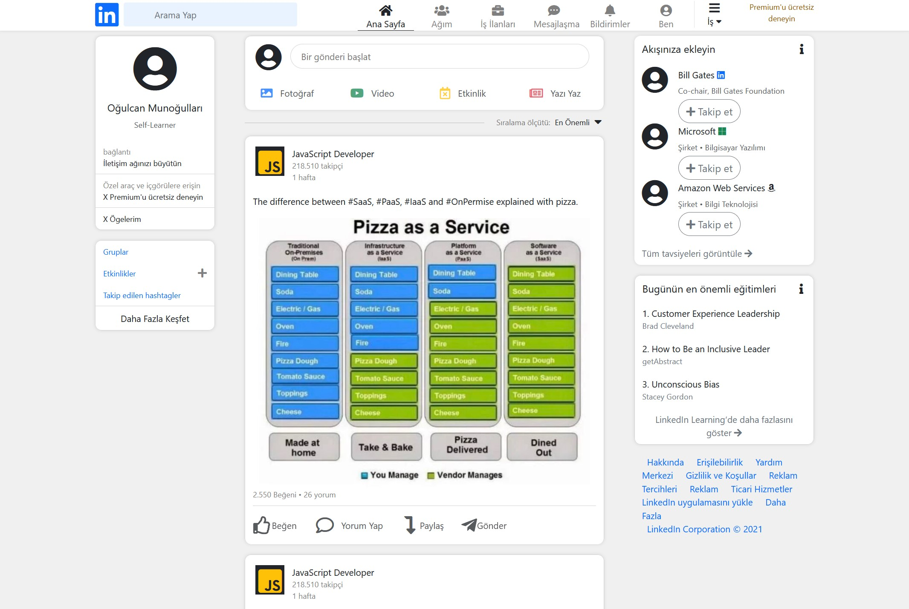

# Patika-Bootstrap-Odev-3
Linkedin Clone with Bootstrap 5

## Explanation
I tried to do it using just bootstrap, I used vanilla css for font sizes, colors and borders. It was the same structure as the original linkedin except for the gaps. I got the icons from fontawesome. This project not responsive, for now.

## Screen Shots
